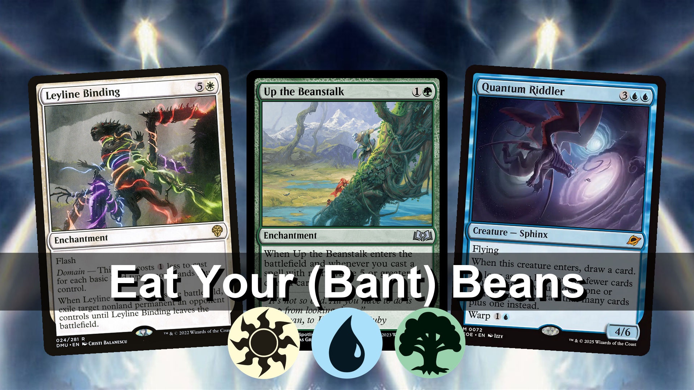

# thumbnaileditor

Automated thumbnail generator for FullControlMTG video content. Composites Magic: The Gathering card images into polished 1920×1080 thumbnails with a mirrored background, foreground card spread, color identity pips, and a styled title bar.

---

## Features

- **Scryfall-native** — provide a standard `scryfall.com/card/...` URL for any card; images are resolved and cached automatically
- **Mirrored background** — card art is scaled to output height and tiled as a symmetric mirror pair
- **1–5 foreground cards** — laid out with configurable scale, overlap, and fan rotation; corners are rounded to match physical card proportions
- **Title bar** — semi-transparent overlay with white text, optional drop shadow, and fully configurable position and height
- **Color identity pips** — MTG mana symbols displayed below the title, in WUBRG order, at a configurable size and position
- **Per-project config** — each project is a folder with a `config.toml`; every setting has a sensible default and can be overridden per project
- **Batch rendering** — render every project in one command; failed projects are skipped and reported, others continue
- **Dry-run validation** — catch config errors without producing output

---

## Requirements

- Python 3.10+
- pip

---

## Installation

```bash
git clone https://github.com/FullControlMTG/thumbnaileditor
cd thumbnaileditor
python3 -m venv env

# macOS / Linux
source env/bin/activate

# Windows
env\Scripts\activate

pip install -r requirements.txt
```

---

## Directory structure

```
thumbnaileditor/
├── main.py                    # Entry point
├── requirements.txt
├── .env.example               # Environment variable template
├── assets/                    # Mana pip PNGs (white.png, blue.png, etc.)
├── thumbnaileditor/
│   ├── cli.py                 # CLI commands
│   ├── config.py              # Global defaults (env vars)
│   ├── project.py             # Per-project config loader
│   ├── render.py              # Image composition pipeline
│   └── scryfall.py            # URL resolution, download, and caching
├── projects/
│   └── <project-name>/
│       └── config.toml
├── example/                   # Example projects with rendered output
├── cache/                     # Downloaded card images (auto-created)
└── output/                    # Rendered thumbnails (auto-created)
```

---

## Global defaults (`.env`)

Copy `.env.example` to `.env` to override any global default:

```env
PROJECTS_FOLDER=./projects
OUTPUT_FOLDER=./output
CACHE_FOLDER=./cache
ASSETS_FOLDER=./assets
OUTPUT_RESOLUTION=1920x1080
CARD_SCALE=0.72
CARD_OVERLAP=0.12
CARD_ROTATION=3.5
TITLE_FONT_SIZE=90
TITLE_BAR_OPACITY=0.55
PIP_RADIUS=50
TITLE_TEXT_DROPSHADOW_OFFSET=3
```

---

## Project config (`projects/<name>/config.toml`)

Each project lives in its own subdirectory. The config is organized into four sections:

```toml
[metadata]
title = "My Video Title"            # Displayed in the title bar
color_identity = ["W", "U", "G"]   # Mana pips shown below the title (WUBRG order)
                                    # Valid values: "W", "U", "B", "R", "G", "C"

[cards]
# Standard Scryfall card page URL — the correct image is fetched automatically
background_card = "https://scryfall.com/card/spg/44/solitude"
foreground_cards = [
    "https://scryfall.com/card/dmu/24/leyline-binding",
    "https://scryfall.com/card/woe/195/up-the-beanstalk",
]
# Optional card layout overrides
card_scale   = 0.72    # Card height as a fraction of output height
card_overlap = -0.05   # Negative = gap between cards; positive = overlap
card_rotation = 3.5    # Max fan angle in degrees

[title]
font_size              = 90     # Title text size in pixels
pip_radius             = 50     # Mana pip radius in pixels
pip_position           = 980    # Pixel y for top of pip row (default: just below bar)
text_dropshadow_offset = 3      # Pixel offset for text drop shadow (0 to disable)

[title.shadow]
position = 750    # Pixel y for top of title bar (default: near bottom)
height   = 160    # Explicit bar height in pixels (default: sized to text)
opacity  = 0.55   # Bar opacity (0.0–1.0)
```

All fields except `[metadata].title`, `[cards].background_card`, and `[cards].foreground_cards` are optional.

---

## Usage

### Render a single project

```bash
python main.py render projects/<name>
```

Output is written to `{OUTPUT_FOLDER}/<name>.png` by default.

| Flag | Description |
|------|-------------|
| `--dry-run` | Validate the config without rendering |
| `-o, --output <path>` | Write output to a custom file path |

```bash
python main.py render projects/my-video --dry-run
python main.py render projects/my-video -o ~/Desktop/thumbnail.png
```

### Render all projects

```bash
python main.py batch
```

Discovers every subdirectory in `PROJECTS_FOLDER` that contains a `config.toml`, renders each one, and continues past any errors (errors are printed to stderr).

```bash
python main.py batch --dry-run
```

---

## Runbook

Clear Cache
```bash
rm -rf ./cache/*   or CACHE_FOLDER
```

Dry Run
```bash
python main.py render projects/my-video --dry-run
```

Live Run (Single)
```bash
python main.py render projects/my-video
```

Live Run (Batch)
```bash
python main.py batch
```
